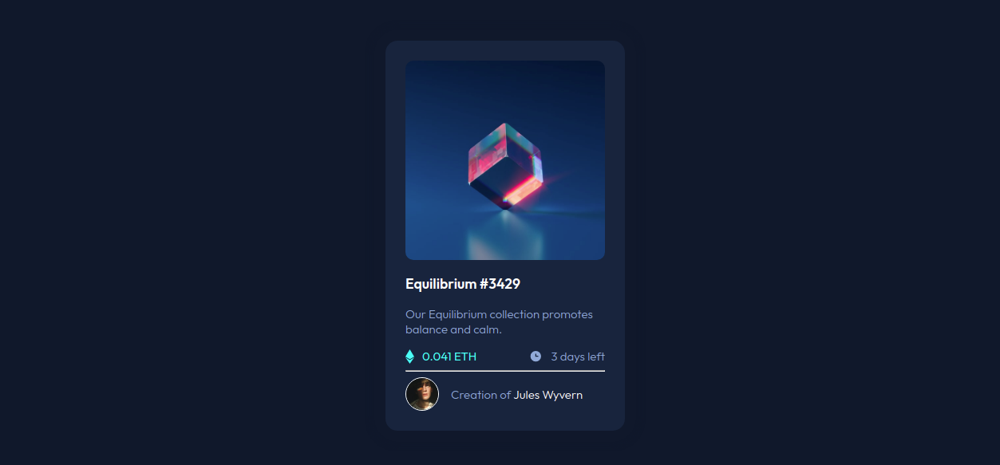

# Frontend Mentor - NFT preview card component solution

This is my solution to the [NFT preview card component challenge on Frontend Mentor](https://www.frontendmentor.io/challenges/nft-preview-card-component-SbdUL_w0U). Frontend Mentor challenges help you improve your coding skills by building realistic projects. 

## Table of contents

- [Overview](#overview)
  - [The challenge](#the-challenge)
  - [Screenshot](#screenshot)
  - [Links](#links)
- [My process](#my-process)
  - [Built with](#built-with)
  - [What I learned](#what-i-learned)

## Overview

### The challenge

Users should be able to:

- View the optimal layout depending on their device's screen size
- See hover states for interactive elements

### Screenshot



### Links

- Live Site URL: [https://braien-machado-nft-preview-card.vercel.app/](https://braien-machado-nft-preview-card.vercel.app/)

## My process

### Built with

- HTML
- CSS

### What I learned

I learned about adjacent-sibling selectors to change css properties of elements while hovering on another.
Before learning it, i would use javascript to set this dependency.

```css
.view-icon:hover + .card-img {
  opacity: 0.6;
}
```

The css above changes opacity of the element with the "card-img" class that is following the one with "view-icon" class when hovering on it.
If you want an article about this selector, check [here](https://meyerweb.com/eric/articles/webrev/200007a.html).
